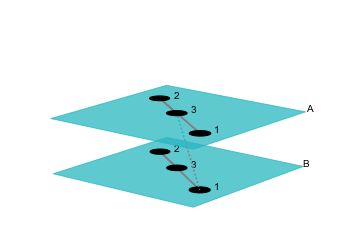

.. _isomorphisms_tutorial:

Isomorphisms and automorphisms
==============================

Requirements
------------

The Multilayer Networks Library uses third party software to solve the graph-isomorphism problems. That is, some of the functionality of **pymnet** depends on having these software installed. Some of the functionality is redundant in a way that multiple third party software packages can be used to use the same problem, and only one of them is needed to be installed to gain access to that functionality.

- NetworkX : Available through *pip*. Allows the usage of following functions: *is_isomorphic*, *get_isomorphism*
- PyBliss : Available at `http://www.tcs.hut.fi/Software/bliss/ <http://www.tcs.hut.fi/Software/bliss/>`_ : Allows the usage of following functions: *is_isomorphic*, *get_isomorphism*, *get_automorphism_generators*, *get_complete_invariant*

Setup
-----

The Multilayer Networks Library can deal with generalized graph isomorphisms introduced in this `article <http://arxiv.org/abs/1309.7233>`_. This tutorial introduces the basic multilayer network isomorphism functionality in this library.

Lets start by creating a multilayer social network:

>>> import pymnet
>>> net_social=pymnet.MultiplexNetwork(couplings='categorical',fullyInterconnected=False)
>>> net_social["Alice","Bob","Friends"]=1
>>> net_social["Alice","Carol","Friends"]=1
>>> net_social["Bob","Carol","Friends"]=1
>>> net_social["Alice","Bob","Married"]=1
>>> fig_social=pymnet.draw(net_social,show=False,layout="spectral",layerPadding=0.2)

.. figure::  small_mplex_notaligned_social.png
   :align:   center

We want to compare networks, so lets create another network. A transportation network this time:

>>> net_transport=pymnet.MultiplexNetwork(couplings='categorical',fullyInterconnected=False)
>>> net_transport["Helsinki","Turku","Train"]=1
>>> net_transport["Helsinki","Tampere","Train"]=1
>>> net_transport["Turku","Tampere","Train"]=1
>>> net_transport["Helsinki","Turku","Ferry"]=1
>>> fig_transport=pymnet.draw(net_transport,show=False,layout="circular",layerPadding=0.2)

.. figure::  small_mplex_notaligned_transport.png
   :align:   center

Isomorphism
-----------

Clearly the two above networks have the same structure but different labels of nodes and layers. In terms of multilayer network isomorphisms, this means that the two networks are node-layer isomorphic (but not node isomorphic or layer isomorphic). This can be confirmed using the *is_isomorphic* function as follows: 

>>> print pymnet.is_isomorphic(net_social,net_transport,allowed_aspects=[0]) #node isomorphism
False
>>> print pymnet.is_isomorphic(net_social,net_transport,allowed_aspects=[1]) #layer isomorphism
False
>>> print pymnet.is_isomorphic(net_social,net_transport,allowed_aspects=[0,1]) #node-layer isomorphism
True

In the above example the different isomorphism types are specified using the *allowed_aspects* parameter, which takes a list of integers each corresponding to one aspect that can be permuted. The node aspect is the 0th aspect by convention as usual.

We can also recover the isomorphic map from the social network node and layer labels to the transportation network node and layer labels using the *get_isomorphism* function:

>>> print pymnet.get_isomorphism(net_social,net_transport)
[{'Bob': 'Turku', 'Alice': 'Helsinki', 'Carol': 'Tampere'}, {'Married': 'Ferry', 'Friends': 'Train'}]

Note that you might want to use the function *get_complete_invariant* if you are doing multiple isomorphism comparisons. The function returns an object that can be directly compared to another complete invariant objects to determine if two networks are isomorphic, and there is no need to rerun the expensive graph isomorphism algorithms.

Automorphisms
-------------

Automorphisms are isomorphisms with the network itself. One can calculate automorphism groups using this library. As automorphism are isomorphisms one needs to specify the type of the automorphism exactly in the same way as one does of isomorphisms. For example, in the above social network one can find the only (non-trivial) automorphism where Bob and Alice change labels:

>>> print pymnet.get_automorphism_generators(net_social,allowed_aspects=[0]) #node isomorphism
[[{'Bob': 'Alice', 'Alice': 'Bob'}, {}]]
>>> print pymnet.get_automorphism_generators(net_social,allowed_aspects=[1]) #layer isomorphism
[]
>>> print pymnet.get_automorphism_generators(net_social,allowed_aspects=[0,1]) #node-layer isomorphism
[[{'Bob': 'Alice', 'Alice': 'Bob'}, {}]]

The *get_automorphism_generators* returns a list of automorphisms that can be used to generate all possible automorphism by combining the permutation operations. That is, the list of automorphisms returned form a *generating set of the automorphism group*.

Note that in the above example the automorphism group given by node isomorphism is the same as the one given by node-layer isomorphism. The node-layer isomorphisms are not always unions of node isomorphisms and layer isomorphisms. To illustrate this, we generate a network that has slightly more interesting automorphism group structure:

>>> net=pymnet.MultilayerNetwork(aspects=1)
>>> net[1,'A'][2,'A']=1
>>> net[2,'A'][3,'A']=1
>>> net[3,'B'][2,'B']=1
>>> net[2,'B'][1,'B']=1
>>> net[3,'A'][1,'B']=1
>>> fig=pymnet.draw(net,show=False,layerPadding=0.2)

Now, for this network there are no (nontrivial) node automorphisms or layer isomorphisms, but there is a node-layer isomorphism:

>>> print pymnet.get_automorphism_generators(net,allowed_aspects=[0])
[]
>>> print pymnet.get_automorphism_generators(net,allowed_aspects=[1])
[]
>>> print pymnet.get_automorphism_generators(net,allowed_aspects=[0,1])
[[{1: 3, 3: 1}, {'A': 'B', 'B': 'A'}]]
